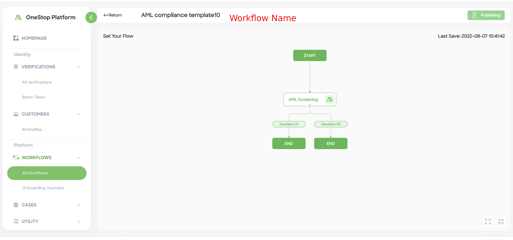

<!-- # AML
 One-stop Platform(OSP) enables banks and financial institution to provides Anti-money Laundering(AML) with AML toolkit.

OSP AML toolkit is important to customer's business, especially for their on-boarding processes. First, financial institutions have to protect themselves from risks and meet AML obligations. Thus, these institutions have to perform an extended AML screening to determine their customer risks and response them according to their business rules. Second, customer risks are not static and change over time, and they should be periodically checked and assessed with new actions. 

OPS AML toolkit provides two APIs and one openAPI to screen and monitor a user's risk. 

## AML Screening (api lib -> workflow)

## AML Monitoring (api lib -> workflow)

## AML MonitoringAndScreening (engine: call directedly)

## How to do integration

## API definitions
--> 
<!-- Start Document Outline -->
* [AML](#AML)
  * [Request an OSP account and login OSP](#Request an OSP account and login OSP)
  * [Setup AML screening and monitoring](#Setup AML screening and monitoring)
	* [Open API Approach](#Markdown Editor)
  	* [Batch Task Approach](#Open API Approach)
  * [Check Monitoring Result](#Check Monitoring Result)
<!-- End Document Outline -->

# AML
This is a reference manual and configuration guide for Anti-Money Laundering(AML) integration. It describes how to request an account, screening&monitoring a user, and check monitoring result in the OSP

## Request an OSP account and login OSP
If you are interested in OSP/AML, please contact our operation team to open an account with OSP permission. 

Once your account is setup, you should be able to login [Sandbox OSP portal](https://sandbox-oop.advai.net/). You can also request your *ADVAI_KEY* for the purpose of authentication and no leak for it.

## Setup AML screening and monitoring

### Open API Approach

This is the simplest way to do AML screening and monitoring. Just copy following command to your shell, replace `${YOUR_ADVAI_KEY}` with your *ADVAI_KEY*, and then execute it. After execution completes, you will get a `transactionId`, via which you can get a detail screening transaction result in the OSP. 

This shell command only instructs OSP to screen a user: `referenceId` is `kun0991412224124` and `name` is `David`, and adds the user to our profile set. Please refer [AML Screening Monitoring](https://github.com/Onestop-advanceAI/APIRepostiroy/blob/master/open_apis/aml_monitoring_screening.md) to check other parameters. 

```shell

curl --location --request POST 'https://sandbox-oop.advai.net/intl/openapi/monitoring/AMLScreeningAndMonitoring' \
--header 'Content-type: application/json' \
--header 'X-ADVAI-KEY: ${YOUR_ADVAI_KEY}' \
'
--data-raw '{                                 
  "name": "David",                    
  "type": [                           
    "Person"                          
  ], 
  "referenceId": "kun0991412224124", 
  "idNumber": "", 
  "dob": "", 
  "regionList": [ 
    "Indonesia" 
  ], 
  "gender": "Female", 
  "mode": 1, 
  "score": 0.95, 
  "contentList": ["OOL"], 
  "intervalTime": 1 
}
'
```

    
### Batch Task Approach
This approach only supports `screening` mode, and the `monitoring` mode will be available soon. 
1. *Step 1: create a AML screening workflow* Login OSP portal and goto menu `WORKFLOWS` > `ALLWorkflows`, and click `AML Compliance` template. In the workflow creation page, you can rename the workflow, and then publish it. 


2. *Step 2: create a batch task* Goto menu `VERIFICATION` > `Batch Tasks`, and create a new task. In the pop window, selected the created workflow by name, and download the corresponding excel template. For the template, fill up batch data you want to screen in the *source* sheet after reading *READ THIS FIRST*.

3. *Step 3*: In the create new task page, click `schedule new cases` after uploading data file, setting task name and scheduled time. 
4, *Step 4*: Download the task result file when the task finishes. In the result file, you can get `caseId` for each data record. 


## Check Monitoring Result
Three approaches to check AML screening and monitoring result when you have a `transactionId`. 
1. *Approach 1* Goto `VERIFICATIONS > All Verifications` and retrieve the `transactionId` in the search box. In this way, you can get transaction detail info, e.g., status, input parameters, and decision result. If there is `case` with this transaction, you can goto menu `CASES > All Cases` to review and finalize the case status in a similar way. 

2. *Approach 2* Retrieve transaction detail information via our Open API [getTransactionDetail](https://github.com/Onestop-advanceAI/APIRepostiroy/blob/master/open_apis/workflow_query_result.md) with `transactionId` and *ADVAI_KEY*.

3. *Approach 3* Setup transaction callback method with us, and OSP will notify you when transaction is made. This feature is not public currently, and you need to contact our engineers to set it up.

