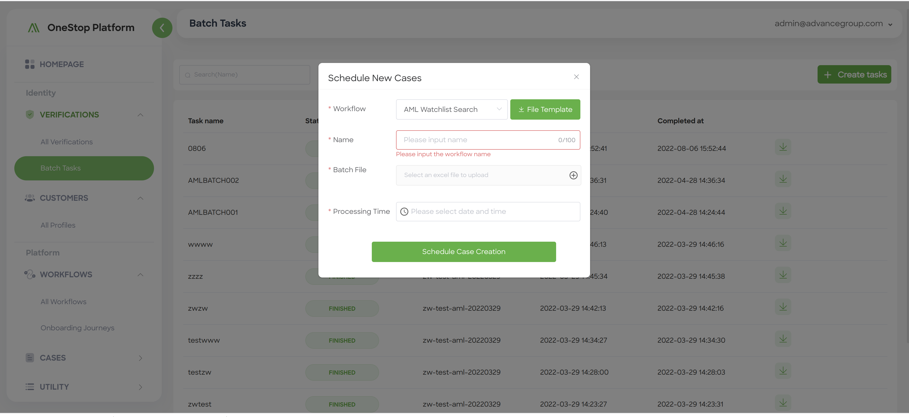

<!-- markdown-toc start - Don't edit this section. Run M-x markdown-toc-refresh-toc -->
**Table of Contents**

- [-](#-)
- [How to get account and key](#how-to-get-account-and-key)
- [Setup AML screening and monitoring](#setup-aml-screening-and-monitoring)
    - [Open API Approach](#open-api-approach)
    - [Batch Task Approach](#batch-task-approach)
    - [Check Monitoring Result](#check-monitoring-result)

<!-- markdown-toc end -->


# AML
This is a reference manual and configuration guide for Anti-Money Laundering(AML) integration. It describes how to request an account, AML screening&monitoring, and check results in the OSP.

## How to get account and key
If you are interested in OSP/AML, please refer [sandbox account opening procedure](https://advancegroup.larksuite.com/docx/doxusnM9TKdmlt9KdBZ3yLJbmrU) (Contact our operation team for PROD environment)to open an account with OSP permission. 

Once your account is setup, verify your account via login [Sandbox OSP portal](https://sandbox-oop.advai.net/). Meanwhile, you also need to request your *ADVAI_KEY* for the purpose of authentication. Protect this key.

## Setup AML screening and monitoring
Two approaches to use AML functions:
### Open API Approach

This is the simplest way to do AML screening and monitoring. Just copy following command to your shell, replace *YOUR_ADVAI_KEY* with your own *ADVAI_KEY*, and then execute it. After complete, you will get a `transactionId` in the response. Later, you can retrieve detail screening result in the OSP portal. 

The sample shell instructs OSP to screen a user: `referenceId` is `kun0991412224124` and `name` is `David`, and adds the user to our profile set. You have to set the mode to be 2 if you also want to monitor `kun0991412224124` risk(e.g., screening its risk periodically). Please refer [AML Screening Monitoring](https://github.com/Onestop-advanceAI/APIRepostiroy/blob/master/open_apis/aml_monitoring_screening.md) to check other parameters. 

```shell

curl --location --request POST 'https://api.advai.net/intl/openapi/monitoring/amlScreeningAndMonitoring' \
--header 'Content-type: application/json' \
--header 'X-ADVAI-KEY: ${YOUR_ADVAI_KEY}' \
--data-raw '{                                 
  "name": "David",                    
  "type": [                           
    "Person"                          
  ], 
  "referenceId": "kun0991412224124", 
  "idNumber": "", 
  "dob": "", 
  "regionList": [ 
    "Indonesia" 
  ], 
  "gender": "Female", 
  "mode": 1, 
  "score": 0.95, 
  "contentList": ["OOL"], 
  "intervalTime": 1 
}
'
```

    
### Workflow Approach
This approach only supports *screening* mode, and the *monitoring* mode will be available soon. 
1. *Step 1: create a AML screening workflow* 

Login OSP portal and goto menu *WORKFLOWS* > *ALLWorkflows*, and click *AML Compliance* template. In the workflow creation page, you can rename the workflow, and then publish it. 


2. *Step 2: create a batch task* 

Goto menu *VERIFICATION* > *Batch Tasks*, and create a new task. In the pop window, select the created workflow by name, and download the corresponding excel template. For the template, fill up batch data you want to screen in the *source* sheet after reading *READ THIS FIRST*. 


3. *Step 3*

In the create new task page, click *schedule new cases* after uploading data file, setting task name and scheduled a time. 

4, *Step 4*: 

Download the task result file when the task finishes. In the result file, you can get `caseId` for each data record. 

The alternative for *step 2* is to call execute the workflow created in **step 1** using OSP Open API [Workflow Submission](https://github.com/Onestop-advanceAI/APIRepostiroy/blob/master/open_apis/workflow_submit.md)


## Check Monitoring Result
Three approaches to check AML screening and monitoring result when you have a `transactionId`. 

1. *Approach 1* 

Goto *VERIFICATIONS* >  *All Verifications* and retrieve the `transactionId` in the search box. In this way, you can get a transaction detail info, e.g., status, input parameters, and decision result. If there is `case` with this transaction, you can goto menu *CASES > All Cases* to review and finalize the case status in a similar way. 

2. *Approach 2* 

Setup a callback method to receive transaction notifications and then get the detail screening result via our OpenAPI [`transaction query` ](https://github.com/Onestop-advanceAI/APIRepostiroy/blob/master/open_apis/workflow_query_result.md). After setuping the callback, OSP pushes transaction status change information(e.g., workflow id, tenant id, and transaction id and status) to customer side, when the transaction ends. Once receiving the notification, your can obtain the detail screening result using the `transaction query` API with your transaction id and *ADVAI_KEY*. 

Additionally, you can also query a case detail information via [`case query`]().

As callback setup is not open to public currently, you need to contact our engineers to set it up. Refer to Page[How to setup transaction callback]()


